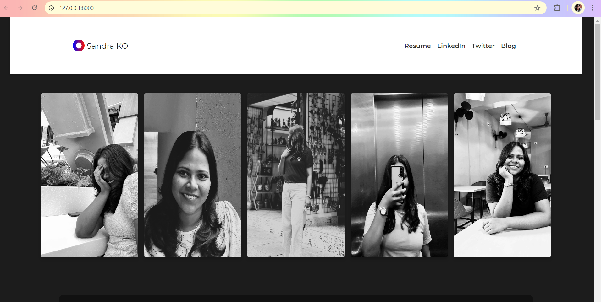
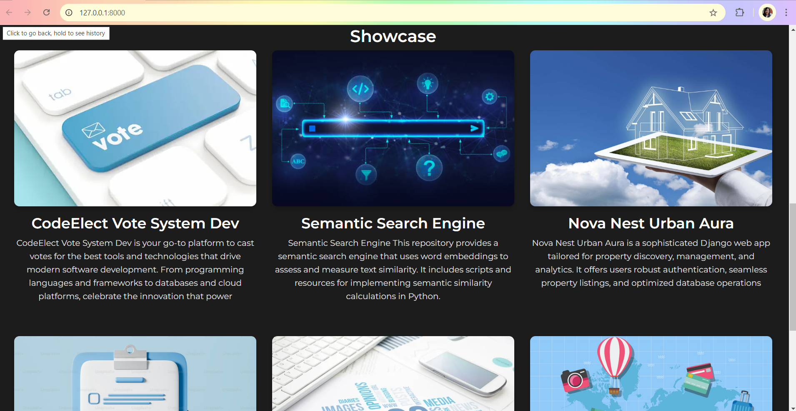
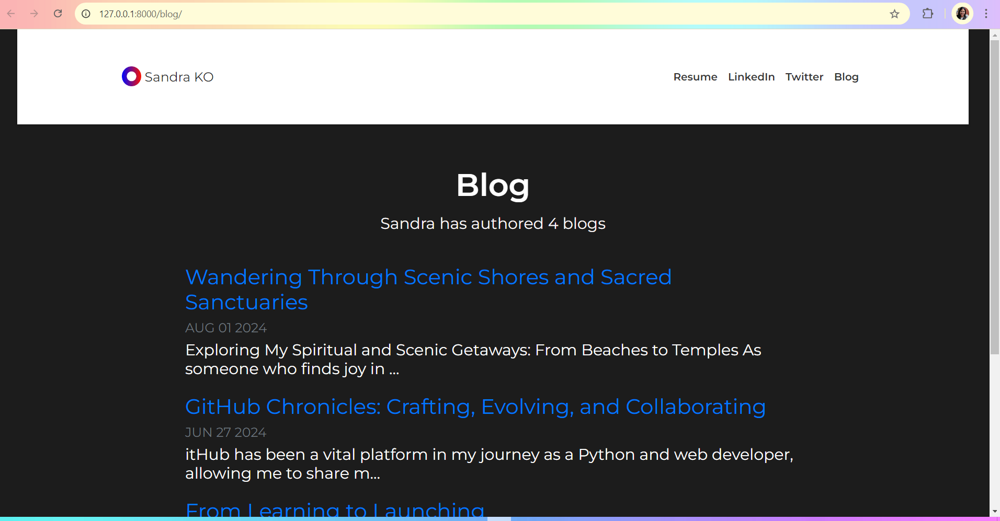
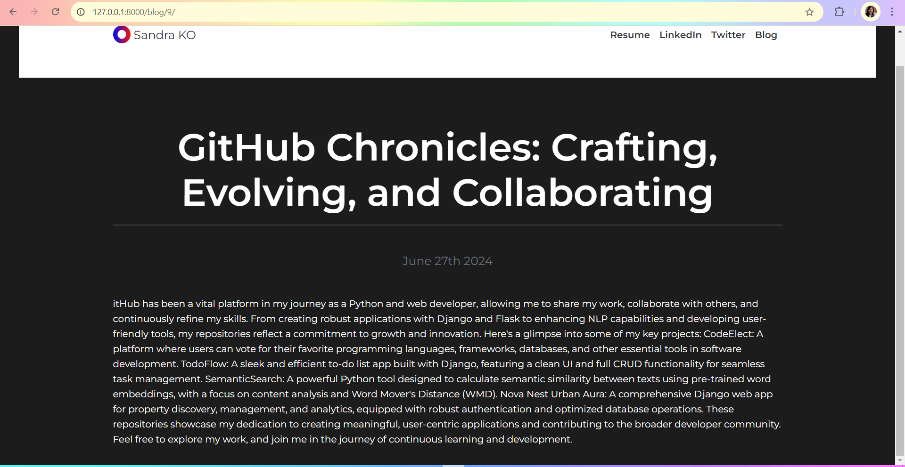

# Crafting-Digital-Excellence-Blog
Explore Sandra's journey as a tech-savvy innovator, where she shares her projects, insights, and passion for creating seamless digital experiences. From voting systems to property management apps, discover the code and creativity behind her work.





## Introduction

The "Crafting Digital Excellence Blog" is a personal blog built using Django, Python, CSS, and HTML. It showcases various projects, including voting systems and property management apps, highlighting the code and creativity that drives digital innovation.

## Features

- Detailed project showcases
- Insightful blog posts on technology and innovation
- Clean and modern UI
- Responsive design for mobile and desktop users

## Installation

To get a local copy up and running, follow these steps:

1. **Clone the repository:**
   ```bash
   git clone https://github.com/yourusername/crafting-digital-excellence-blog.git
